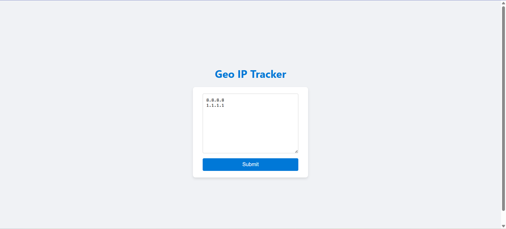

# Geo IP Tracker

A lightweight web-based tool that takes a list of IP addresses and returns geolocation information for each one, including a downloadable `.csv` report and a visual map rendered using Folium. The tool uses `ip-api.com` to gather IP information.

## Features

* Web interface for submitting IP addresses
* Session-based storage using cookies
* Fetches IP geolocation data via `http://ip-api.com/json/`
* Exports results to CSV
* Generates an interactive map with markers for each IP
* Serves generated files for download

## Directory Structure

```
.
├── geo_ip_tracker.py         # Main script to process IPs and generate map + CSV
├── HTTP_SERVER.py                 # Web server (built using http.server)
├── cleanup.sh                # Cleanup script to clear session files
├── downloads/                # Output directory for generated files
├── users/                    # Temporary user session storage
```

## Requirements

* Python 3
* Packages:

  * requests
  * folium

Install dependencies with:

```bash
pip install requests folium
```

## Running the App

### 1. Start the Web Server

```bash
python3 server.py
```

This will start a local web server on `http://localhost:8080`

### 2. Submit IPs

* Open `http://localhost:8080` in your browser
* Paste IPs (one per line) into the form
* Click "Submit"

### 3. Get Results

* After submission, links will appear to download:

  * `ip_info.csv` (geolocation data)
  * `map.html` (interactive map with markers)

## Running `geo_ip_tracker.py` Manually

You can also run the tracker from the terminal:

```bash
python3 geo_ip_tracker.py <input_file> <user_id>
```

* `input_file`: Path to a file containing IPs (one per line)
* `user_id`: A unique session ID (used as a folder name)

Example:

```bash
python3 geo_ip_tracker.py ips.txt testuser123
```

## Cleanup

To remove generated files and user sessions:

```bash
bash cleanup.sh
```

This will delete everything inside `users/` and `downloads/`.

## Notes

* The server uses cookies to maintain session IDs.
* If IP lookup fails or the IP is invalid, it is skipped.
* You can modify the Folium map style by changing the tile URL.

## License

MIT License
